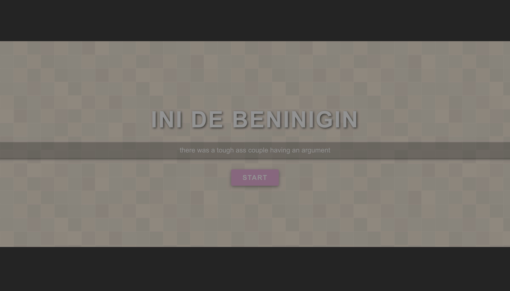
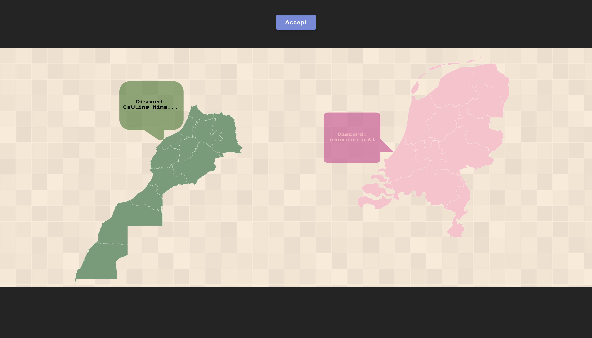
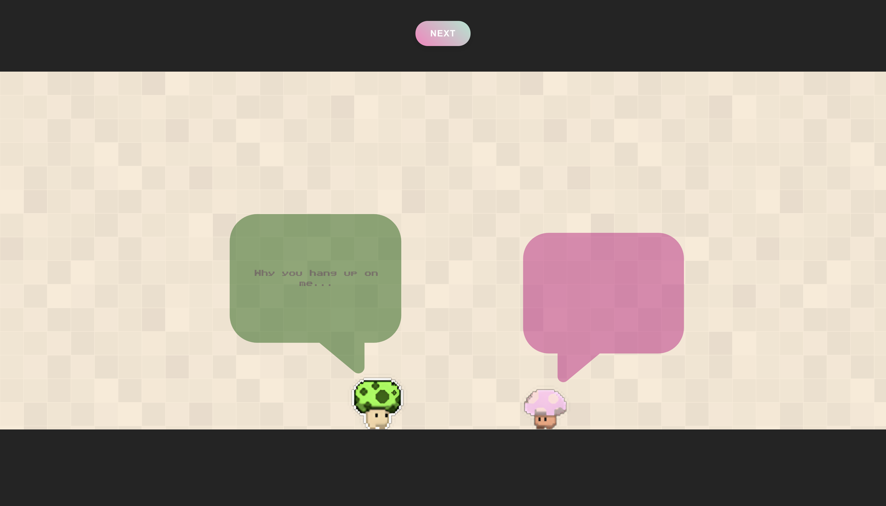

# ❤️ Mini Valentine Roleplay App

A small and cute React project featuring a mini Valentine-themed website where two roleplayed characters have an argument—only for it to end with a sweet surprise gift. This was a fun way to warm up with React and make something special for someone. 💖

---

## 🚀 Features

- Two characters engaging in a playful argument.
- Dynamic text interactions.
- Customizable character dialogues.
- gift revealed at the end.
- Styled with love! 💕

---

## 🔧 Tech Stack

- React (with hooks) and custom logic
- Vanilla CSS

---

## ⚠️ Important Notice

🔴 **This project does not support mobile yet!** 🔴  
Please use a desktop browser for the best experience.

---

## 🎁 Why This Exists

This project was created as a fun experiment with React while making something personal and heartfelt. It's a simple yet special way to express emotions through code. 💌

---

## 🛠️ Setup & Installation

1. Clone the repo:
    ```bash
    git clone https://github.com/Poider/2025Valentine
    ```

2. Navigate to the project folder:
    ```bash
    cd 2025Valentine
    ```

3. Install dependencies:
    ```bash
    npm install
    ```

4. Run the development server:
    ```bash
    npm start
    ```

5. Open [http://localhost:5173/](http://localhost:5173/) in your browser.

---

## 💡 Future Improvements

- Mobile responsiveness.
- More interaction and animations.

---

## 🎯 Contributing

This was a personal project, but feel free to fork it and add your own touches! PRs are welcome if you want to help make it better. 😊

---
##  Preview:





## 📜 License

MIT License. Feel free to use and modify!

Made with ❤️ for someone special.
